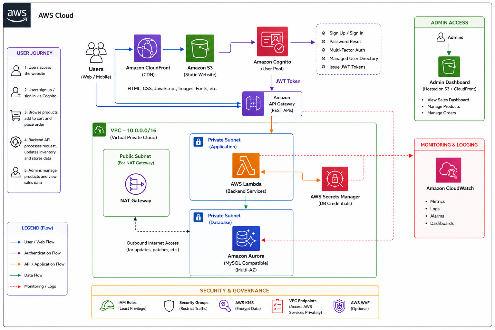
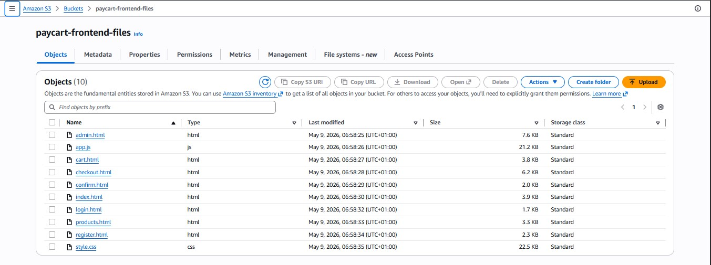
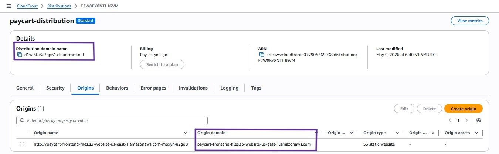
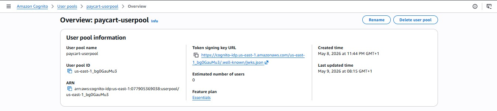
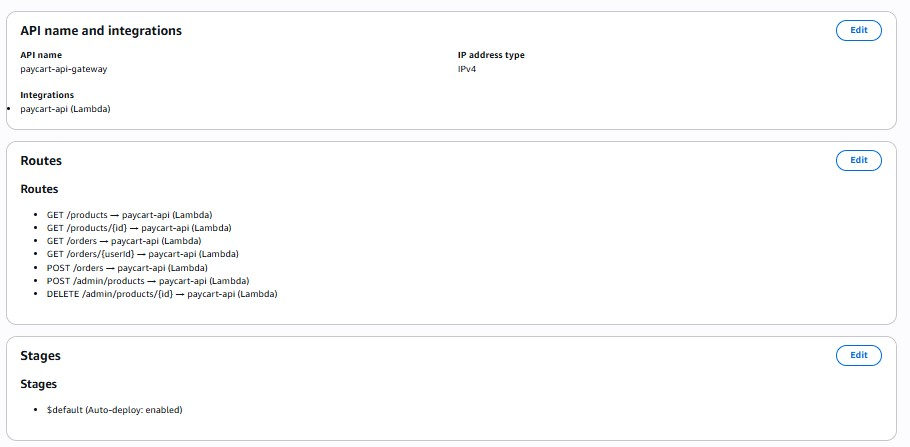
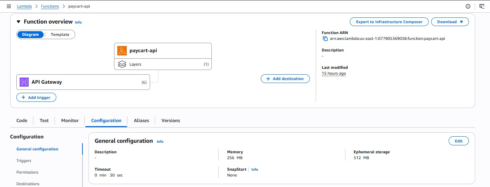
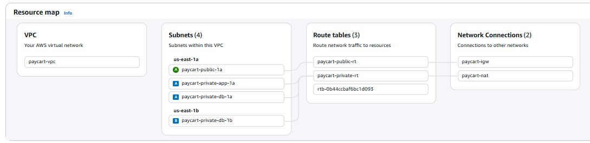

# PayCart

<div align="center">

<!-- SCREENSHOT: Full homepage loaded on CloudFront — wide browser view showing hero, category pills and product grid -->
**A fully serverless, cloud-native electronics e-commerce platform built on AWS**

</div>

---

## Overview

PayCart is a cloud-native electronics e-commerce platform that migrates a startup from unstable shared hosting to a fully managed, scalable AWS infrastructure. The platform supports the complete shopping journey, browsing products by category, user authentication, cart management, order placement, and an admin dashboard for managing inventory and viewing sales data.

**Business requirements met:**

- Three-tier architecture — frontend, backend, database
- Serverless compute scales automatically with demand
- Secure authentication with JWT tokens via Amazon Cognito
- All credentials managed via AWS Secrets Manager — no hardcoded passwords
- Database and compute isolated in private VPC subnets
- Data encrypted at rest with AWS KMS
- Global HTTPS delivery via CloudFront CDN
- Monitoring and alerting via Amazon CloudWatch
- Role-based access — admin vs regular user via Cognito Groups

---

## Live Demo

| Resource | URL |
|----------|-----|
| Live Site | https://d1wi6fa3c7qp61.cloudfront.net |
| Admin Panel | https://d1wi6fa3c7qp61.cloudfront.net/admin.html |
| API Base | https://a34s4caq37.execute-api.us-east-1.amazonaws.com |

> Products are live and fully connected to the backend database.
> Register an account to browse, add to cart, and place orders.

---

## Architecture

<!-- SCREENSHOT: draw.io architecture diagram exported as PNG — full diagram showing all services and flow arrows -->


### Network Layout

| Subnet | CIDR | AZ | Purpose |
|--------|------|----|---------|
| paycart-public-1a | 10.0.1.0/24 | us-east-1a | NAT Gateway |
| paycart-private-app-1a | 10.0.2.0/24 | us-east-1a | Lambda functions |
| paycart-private-db-1a | 10.0.3.0/24 | us-east-1a | RDS primary |
| paycart-private-db-1b | 10.0.4.0/24 | us-east-1b | RDS secondary |

---

## AWS Services

### Amazon S3 — Static Hosting



Stores and serves all frontend files.

```
Bucket         : paycart-frontend-files
Hosting        : Static website enabled
Encryption     : SSE-KMS (aws/s3)
Public access  : Read-only via bucket policy
```

**Why S3 over a web server:** No patching, no maintenance, near-zero cost at demo scale, and native CloudFront integration. A traditional Apache/Nginx server on EC2 would cost money even when idle.

---

### Amazon CloudFront — CDN



Delivers the frontend globally over HTTPS.

```
Distribution   : https://d1wi6fa3c7qp61.cloudfront.net
Origin         : S3 website endpoint (HTTP only — see Lessons Learned)
Protocol       : Redirect HTTP → HTTPS
Default root   : index.html
```

**Why CloudFront:** S3 website endpoints only support HTTP. CloudFront handles HTTPS, which is required for Cognito to work securely in the browser.

---

### Amazon Cognito — Authentication



Handles all user identity — sign-up, sign-in, email verification, and JWT tokens.

```
User Pool ID   : us-east-1_bg0GauMu3
App Client     : paycart-web
Client ID      : 52gt24l0hu788fk5h923mp4m64
Sign-in        : Email + Password
MFA            : Disabled (can be enabled for production)
Groups         : admin (dashboard access)
Free Tier      : 50,000 active users/month
```

**Why Cognito over custom auth:** Building a secure authentication system from scratch requires cryptographic expertise. Cognito handles password hashing, token expiry, refresh tokens, and brute-force protection out of the box.

**How it works in the frontend — no SDK needed:**

```javascript
// Direct fetch to Cognito API — works in plain HTML/JS
const response = await fetch(
  "https://cognito-idp.us-east-1.amazonaws.com/",
  {
    method: "POST",
    headers: {
      "Content-Type": "application/x-amz-json-1.1",
      "X-Amz-Target": "AWSCognitoIdentityProviderService.InitiateAuth"
    },
    body: JSON.stringify({
      AuthFlow: "USER_PASSWORD_AUTH",
      ClientId: "52gt24l0hu788fk5h923mp4m64",
      AuthParameters: { USERNAME: email, PASSWORD: password }
    })
  }
);

// Returns IdToken, AccessToken, RefreshToken
const { AuthenticationResult } = await response.json();
```

The `IdToken` (JWT) is decoded to check the user's Cognito group and attached to every API call:

```javascript
// Admin check — decode JWT without any library
const payload = JSON.parse(atob(token.split(".")[1]));
const groups = payload["cognito:groups"] || [];
const isAdmin = groups.includes("admin");
```

---

### Amazon API Gateway — HTTP API



Exposes Lambda as public HTTP endpoints.

```
API Name       : paycart-api-gateway
Type           : HTTP API (70% cheaper than REST API)
CORS           : Enabled on all routes
Auth           : Cognito JWT authoriser on protected routes
Base URL       : https://a34s4caq37.execute-api.us-east-1.amazonaws.com
```

| Method | Route | Auth | Description |
|--------|-------|------|-------------|
| GET | `/products` | Public | Fetch all products |
| GET | `/products/{id}` | Public | Fetch single product |
| GET | `/orders` | Required | Fetch all orders (admin) |
| GET | `/orders/{userEmail}` | Required | Fetch orders by user |
| POST | `/orders` | Required | Place a new order |
| POST | `/admin/products` | Required | Add a product |
| DELETE | `/admin/products/{id}` | Required | Delete a product |

---

### AWS Lambda — Serverless Backend



One Lambda function handles all API routes intelligently.

```
Function       : paycart-api
Runtime        : Node.js 20.x
Memory         : 256 MB
Timeout        : 30 seconds
VPC            : paycart-vpc (private app subnet)
Role           : paycart-lambda-role (least privilege)
Layer          : paycart-mysql2-layer (mysql2 + AWS SDK)
Free Tier      : 1,000,000 requests/month
```

**Why one function over many:** Simpler deployment, easier debugging, one layer to manage, and sufficient for a startup-scale platform.

**Route handling logic:**

```javascript
exports.handler = async (event) => {
  const method = event.requestContext?.http?.method;
  const path   = event.rawPath;

  // Credentials fetched from Secrets Manager — never hardcoded
  const conn = await getConnection();

  if (method === 'GET' && path === '/products') {
    const [rows] = await conn.execute('SELECT * FROM products');
    return respond(200, rows);
  }

  if (method === 'POST' && path === '/orders') {
    const { user_email, total_amount, items } = JSON.parse(event.body);
    // Insert order → insert items → reduce stock
    // ...
    return respond(201, { success: true, order_id: orderId });
  }

  // ... all other routes
};
```

---

### Amazon RDS — MySQL 8.0

Primary relational database for all application data.

```
Engine         : MySQL 8.0
Instance       : db.t3.micro
Endpoint       : paycart-db.c6vw2waesuoi.us-east-1.rds.amazonaws.com
Port           : 3306
Database       : paycart
Subnet Group   : paycart-db-subnet-group (private subnets)
Public Access  : NO
Encryption     : KMS (aws/rds)
Backup         : 7-day retention
```

**Why MySQL over DynamoDB:** E-commerce data is relational. Orders reference products via foreign keys. Complex JOIN queries and referential integrity are natural in SQL and awkward in NoSQL.

> **Note:** Original design specified Aurora MySQL Multi-AZ. Substituted with MySQL 8.0 RDS due to free tier limitations. Query syntax is identical — zero code changes needed. Aurora Multi-AZ would be used in production.

---

### AWS Secrets Manager

Stores database credentials securely.

```
Secret name    : db-credentials
Contents       : host, username, password, database
Access         : Lambda IAM role only
```

**Why not environment variables:** Environment variables are visible in plaintext in the AWS console and in deployment packages. Secrets Manager encrypts them and provides a full audit log of every access.

```javascript
// Lambda fetches credentials at runtime — password never in code
const client = new SecretsManagerClient({ region: 'us-east-1' });
const secret = await client.send(
  new GetSecretValueCommand({ SecretId: 'db-credentials' })
);
const { host, username, password } = JSON.parse(secret.SecretString);
```

---

### VPC + Networking



Custom isolated network protecting all backend resources.

```
VPC CIDR         : 10.0.0.0/16
Internet Gateway : paycart-igw
NAT Gateway      : paycart-nat (Zonal — public subnet)
```

**Security Groups:**

```
paycart-db-sg      → Port 3306 from paycart-lambda-sg ONLY
paycart-lambda-sg  → No inbound · All outbound
```

---

### Amazon CloudWatch — Monitoring

<!-- SCREENSHOT: CloudWatch dashboard showing Lambda invocations, API Gateway requests, RDS CPU -->

```
Dashboard      : paycart-dashboard
Lambda metrics : Invocations, Errors, Duration
API metrics    : Count, 5XXError, Latency
RDS metrics    : CPUUtilization, Connections, FreeStorageSpace

Alarms:
  paycart-lambda-errors  → Lambda errors > 5 in 5 min
  paycart-api-5xx-errors → API 5XX errors > 3 in 5 min
  paycart-rds-high-cpu   → RDS CPU > 80%
```

---

### AWS IAM + KMS

```
Lambda role    : paycart-lambda-role
Permissions    : VPC access, RDS data, Secrets Manager read,
                 CloudWatch logs — nothing more

KMS encryption:
  RDS          : aws/rds managed key
  S3           : aws/s3 managed key
```

---

## Frontend Pages

<!-- SCREENSHOT: Homepage with 12 products loaded across categories, category pills visible -->

| Page | File | Description |
|------|------|-------------|
| Homepage | `index.html` | Product grid with live category filtering |
| Product Detail | `product.html` | Single product with stock badge and add to cart |
| Cart | `cart.html` | Items, quantities, VAT, order summary |
| Checkout | `checkout.html` | Delivery form, payment method, order confirmation |
| Sign In | `login.html` | Cognito email login — admins land on dashboard |
| Register | `register.html` | Cognito sign-up |
| Confirm | `confirm.html` | 6-digit email verification from Cognito |
| Admin | `admin.html` | Stats, product management, orders — admin group only |
| Live Demo | []() | Project Walkthrough
<!-- SCREENSHOT: Admin dashboard showing 4 stat cards and products table with categories -->

---

## Database Schema

```sql
CREATE DATABASE paycart;
USE paycart;

CREATE TABLE products (
  id          INT AUTO_INCREMENT PRIMARY KEY,
  name        VARCHAR(200)     NOT NULL,
  category    VARCHAR(100),
  description TEXT,
  price       DECIMAL(10,2)    NOT NULL,
  stock_qty   INT DEFAULT 0,
  image_url   VARCHAR(500)
);

CREATE TABLE orders (
  id           INT AUTO_INCREMENT PRIMARY KEY,
  user_email   VARCHAR(100),
  total_amount DECIMAL(10,2),
  status       ENUM('pending','paid','shipped','delivered'),
  created_at   TIMESTAMP DEFAULT CURRENT_TIMESTAMP
);

CREATE TABLE order_items (
  id         INT AUTO_INCREMENT PRIMARY KEY,
  order_id   INT,
  product_id INT,
  quantity   INT,
  unit_price DECIMAL(10,2),
  FOREIGN KEY (order_id)   REFERENCES orders(id),
  FOREIGN KEY (product_id) REFERENCES products(id)
);
```

### API → Table Mapping

| Route | Reads | Writes |
|-------|-------|--------|
| GET /products | products | — |
| GET /products/{id} | products | — |
| POST /orders | products | orders, order_items |
| GET /orders | orders | — |
| POST /admin/products | — | products |
| DELETE /admin/products/{id} | — | products |

> **Design note:** Users are managed entirely by Amazon Cognito. The `user_email`
> column in orders links back to the Cognito user directory without requiring a
> separate users table in RDS.

---

## API Reference

**Base URL:** `https://a34s4caq37.execute-api.us-east-1.amazonaws.com`

### GET /products
Returns all products.

```bash
curl https://a34s4caq37.execute-api.us-east-1.amazonaws.com/products
```

```json
[
  {
    "id": 4,
    "name": "Samsung Galaxy A55",
    "category": "Phones",
    "description": "6.6-inch Super AMOLED display...",
    "price": "485000.00",
    "stock_qty": 30,
    "image_url": "https://..."
  }
]
```

### POST /orders
Places a new order. Requires Cognito JWT token.

```bash
curl -X POST \
  https://a34s4caq37.execute-api.us-east-1.amazonaws.com/orders \
  -H "Authorization: Bearer <JWT_TOKEN>" \
  -H "Content-Type: application/json" \
  -d '{
    "user_email": "user@example.com",
    "total_amount": 485000,
    "items": [
      { "product_id": 4, "quantity": 1, "unit_price": 485000 }
    ]
  }'
```

```json
{ "success": true, "order_id": 7 }
```

### POST /admin/products
Adds a new product. Requires Cognito JWT token.

```bash
curl -X POST \
  https://a34s4caq37.execute-api.us-east-1.amazonaws.com/admin/products \
  -H "Authorization: Bearer <JWT_TOKEN>" \
  -H "Content-Type: application/json" \
  -d '{
    "name": "Sony WH-1000XM4",
    "category": "Audio",
    "description": "Industry-leading noise cancellation...",
    "price": 285000,
    "stock_qty": 25,
    "image_url": "https://..."
  }'
```

---

## Authentication

PayCart uses Amazon Cognito for authentication. The frontend communicates directly
with the Cognito API using `fetch()` — no SDK required.

**Sign-up flow:**
```
1. User fills register.html → cognitoSignUp() called
2. Cognito sends 6-digit verification code to email
3. User enters code on confirm.html → cognitoConfirmSignUp()
4. Account confirmed → redirected to login.html
```

**Sign-in flow:**
```
1. User enters email + password on login.html
2. cognitoSignIn() → Cognito validates credentials
3. Returns IdToken, AccessToken, RefreshToken
4. Tokens stored in localStorage
5. Admin users (cognito:groups includes "admin") → admin.html
6. Regular users → index.html
```

**API authorisation:**
```
Every API call attaches the IdToken:
Authorization: Bearer <IdToken>

API Gateway validates this token with Cognito automatically.
Invalid or expired tokens receive 401 Unauthorized.
```

---

## Security

| Layer | Mechanism | Protection |
|-------|-----------|------------|
| Network | Private subnets | RDS and Lambda unreachable from internet |
| Network | Security Groups | Port 3306 open only to Lambda SG |
| Authentication | Cognito JWT | All write routes require valid token |
| Authorisation | Cognito Groups | Admin routes check for "admin" group |
| Credentials | Secrets Manager | No passwords in any file or variable |
| Encryption | KMS (RDS + S3) | All data at rest encrypted |
| Transport | CloudFront HTTPS | All traffic in transit encrypted |
| Access Control | IAM Least Privilege | Lambda has minimum required permissions |
| (Planned) | AWS WAF | Block SQL injection, XSS, rate limiting |

---

## Setup Guide

### Prerequisites
```
- AWS Account with AdministratorAccess IAM user
- AWS CLI configured (aws configure)
- Node.js v20+ installed
- VS Code
- Git
- All resources in us-east-1 (N. Virginia) — set this first
```

### 1. VPC and Networking

```bash
# Create VPC: 10.0.0.0/16
# Create 4 subnets across us-east-1a and us-east-1b
# Create Internet Gateway → attach to VPC
# Create Zonal NAT Gateway in public subnet → allocate Elastic IP
# Public route table  → 0.0.0.0/0 → Internet Gateway
# Private route table → 0.0.0.0/0 → NAT Gateway
```

### 2. Security Groups

```bash
# paycart-db-sg
Inbound: MySQL/Aurora port 3306 from paycart-lambda-sg

# paycart-lambda-sg
Inbound: none
Outbound: all traffic
```

### 3. RDS Database

```bash
Engine     : MySQL 8.0
Template   : Free Tier
Instance   : db.t3.micro
VPC        : paycart-vpc
Subnet     : paycart-db-subnet-group
Public     : No
Encryption : Enable (aws/rds)
```

```sql
-- Connect via EC2 bastion host (temporary)
-- On Amazon Linux 2023: sudo dnf install mariadb105 -y
mysql -h <endpoint> -u admin -p

CREATE DATABASE paycart;
USE paycart;
-- Run full schema above
```

### 4. Secrets Manager

```bash
Secret type : Credentials for Amazon RDS
Name        : db-credentials
Select your RDS instance
```

### 5. Cognito

```bash
# Create User Pool
Sign-in    : Email
Pool name  : paycart-userpool

# Create App Client
Name       : paycart-web
Type       : Single-page application (SPA)
Auth flows : USER_PASSWORD_AUTH, SRP

# Create admin group
Group name : admin

# Create admin user via CLI
aws cognito-idp admin-set-user-password \
  --user-pool-id <pool-id> \
  --username <admin-email> \
  --password "<password>" \
  --permanent

aws cognito-idp admin-add-user-to-group \
  --user-pool-id <pool-id> \
  --username <admin-email> \
  --group-name admin
```

### 6. Lambda Layer

```bash
mkdir lambda-layer && cd lambda-layer
mkdir -p nodejs && cd nodejs
npm install mysql2 @aws-sdk/client-secrets-manager
cd ..

# Windows
powershell Compress-Archive -Path nodejs -DestinationPath mysql2-layer.zip

# Upload to Lambda → Layers → Create Layer
Name     : paycart-mysql2-layer
Runtime  : Node.js 20.x
```

### 7. Lambda Function

```bash
# Console → Lambda → Create Function
Name    : paycart-api
Runtime : Node.js 20.x
Role    : paycart-lambda-role

# Add layer: paycart-mysql2-layer
# Paste index.js code from /backend/index.js
# Configuration → VPC → paycart-vpc, paycart-private-app-1a, paycart-lambda-sg
# Configuration → General → Timeout: 30s, Memory: 256MB
```

### 8. API Gateway

```bash
# Console → API Gateway → Create → HTTP API
Name: paycart-api-gateway

# Add routes (all integrated with paycart-api Lambda):
GET    /products
GET    /products/{id}
GET    /orders
GET    /orders/{userEmail}
POST   /orders
POST   /admin/products
DELETE /admin/products/{id}

# Enable CORS: Allow-Origin: *, Allow-Headers: Content-Type,Authorization
```

### 9. Frontend Deployment

```bash
# Update API_URL in app.js
const API_URL = "https://api-gateway-url";

# Upload all files to S3
# Console → S3 → paycart-frontend → Upload

# S3 Bucket Policy
{
  "Version": "2012-10-17",
  "Statement": [{
    "Effect": "Allow",
    "Principal": "*",
    "Action": "s3:GetObject",
    "Resource": "arn:aws:s3:::paycart-frontend/*"
  }]
}

# Enable static website hosting
Index document : index.html
Error document : index.html
```

### 10. CloudFront

```bash
# Create Distribution
Origin domain  : paycart-frontend-files.s3-website-us-east-1.amazonaws.com
                 (type manually — do NOT use the S3 dropdown)
Protocol       : HTTP only
Viewer protocol: Redirect HTTP to HTTPS
Default root   : index.html
```

---

## Cost Analysis

| Service | Free Tier | Our Usage | Est. Cost |
|---------|-----------|-----------|-----------|
| Lambda | 1M requests/month | < 50,000 | **Free** |
| API Gateway | 1M calls/month | < 50,000 | **Free** |
| S3 | 5 GB storage | < 50 MB | **Free** |
| CloudFront | 1 TB transfer/month | < 1 GB | **Free** |
| Cognito | 50,000 users/month | < 20 users | **Free** |
| RDS MySQL | 750 hrs db.t3.micro | ~730 hrs | **Free** |
| CloudWatch | 10 metrics, 5 GB logs | Basic | **Free** |
| KMS | 20,000 requests/month | < 1,000 | **Free** |
| Secrets Manager | Not in free tier | 1 secret | ~$0.40/mo |
| NAT Gateway | Not in free tier | Zonal NAT | ~$15–33/mo |
| **Total** | | | **~$15–34/mo** |

**Cost decisions made:**
- Lambda over EC2 → Lambda is free at rest. EC2 charges 24/7 (~$8–15/mo minimum)
- HTTP API over REST API → 70% cheaper per million calls
- Serverless removes need for Application Load Balancer (~$18/mo saved)
- VPC Endpoints ($7.30/mo) would replace NAT Gateway in a production cost pass

---

## Lessons Learned

### 1. Set your AWS region before creating anything

**Problem:** Resources were created in different regions. CloudFront couldn't find S3,
and CloudWatch dashboards showed empty metrics because Lambda existed in a different region.

**Fix:** All resources deleted and recreated in `us-east-1`.

> Rule: Set `us-east-1` in the console dropdown before every session. Verify before creating any resource.

---

### 2. Aurora MySQL is not free tier eligible

**Problem:** Original design specified Aurora Multi-AZ. Aurora requires ~$70/month minimum.

**Fix:** MySQL 8.0 on RDS (free tier). Query syntax is identical — zero code changes needed.

---

### 3. CloudFront origin must be the S3 website endpoint

**Problem:** Selecting S3 from the CloudFront dropdown uses the REST endpoint,
causing a `504 Gateway Timeout` error.

**Fix:** Manually type the website endpoint:
```
paycart-frontend.s3-website-us-east-1.amazonaws.com
```
Set protocol to `HTTP only`. CloudFront handles HTTPS for the user.

---

### 4. Private RDS cannot be accessed from CloudShell or a laptop

**Problem:** After creating RDS in a private subnet, there was no way to run SQL to create tables.

**Fix:** Temporary EC2 bastion host in the public subnet. SSH in, run SQL, terminate.

```bash
# Amazon Linux 2023 — mysql package unavailable
sudo dnf install mariadb105 -y

mysql -h <paycart-db.c6vw2waesuoi.us-east-1.rds.amazonaws.com> -u admin -p
```

---

### 5. NAT Gateway requires special IAM permissions

**Problem:** Standard NAT Gateway creation failed due to a missing service-linked role.

**Fix:** Zonal NAT Gateway — available without the service-linked role requirement.

---

### 6. Cognito admin users require permanent password via CLI

**Problem:** Admin users created in the Cognito console always have a temporary password,
triggering a `NEW_PASSWORD_REQUIRED` challenge that a plain login page cannot handle.

**Fix:**
```bash
aws cognito-idp admin-set-user-password \
  --user-pool-id <pool-id> \
  --username <email> \
  --password "<password>" \
  --permanent
```

---

### 7. Lambda double-slash URL bug

**Problem:** Frontend was calling `//products` instead of `/products` due to a trailing
slash in the `API_URL` constant.

**Fix:** Remove trailing slash:
```javascript
const API_URL = "https://a34s4caq37.execute-api.us-east-1.amazonaws.com"; // no slash
```

---

## Repository Structure

```
paycart/
├── frontend/
│   ├── index.html          # Homepage — product grid + category filter
│   ├── product.html        # Product detail page
│   ├── cart.html           # Shopping cart
│   ├── checkout.html       # Order placement
│   ├── login.html          # Cognito sign-in
│   ├── register.html       # Cognito sign-up
│   ├── confirm.html        # Email verification
│   ├── admin.html          # Admin dashboard (restricted)
│   ├── style.css           # Global stylesheet
│   └── app.js              # All JS — Cognito, cart, API calls
├── backend/
│   ├── lambda-layer/
│   │   └── nodejs/         # mysql2 + AWS SDK dependencies
│   └── index.js            # Lambda function — all API routes
├── database/
│   └── schema.sql          # Full database schema
└── README.md
```

---

<div align="center">

*Frontend → S3 + CloudFront · Auth → Cognito · API → Lambda + API Gateway · DB → RDS MySQL*

</div>
